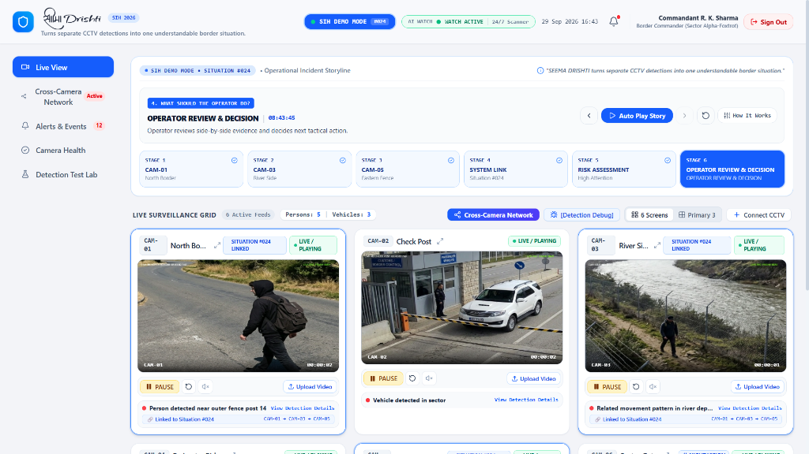
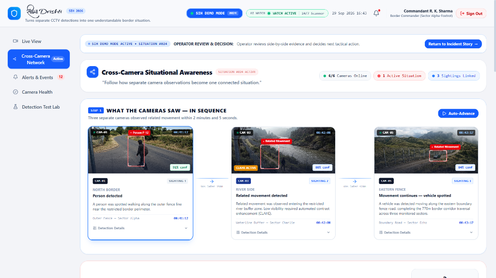
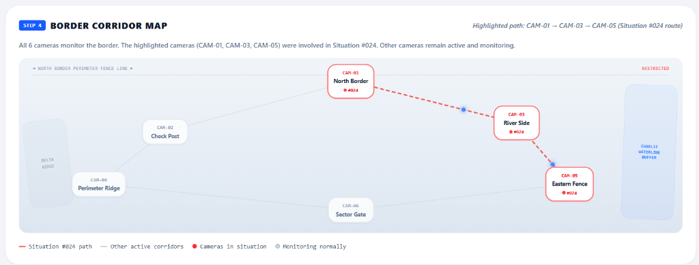

# सीमा Drishti (Seema Drishti) — Cross-Camera Situational Awareness Platform

**Smart India Hackathon 2026** | **Problem Statement: SIH26187**  
*Ministry of Home Affairs (MHA): AI-Based Intelligent Video Analytics Platform for Border Surveillance using existing CCTV Infrastructure.*

**Created & Engineered by Kartik Bendre**  
*Full-stack architecture engineered from scratch — featuring a custom React + Tailwind frontend, an OpenCV adaptive dehazing pipeline, Ultralytics YOLOv8 inference, and spatiotemporal cross-camera correlation (no pre-made UI templates).*

---

## 📸 System Screenshots & Visual Overview

### 1. Live Surveillance Command Grid & Operational Incident Storyline
The primary command center renders 6 synchronized border CCTV feeds with real-time YOLOv8 bounding boxes, detection telemetry, and multi-stage operational storyline tracking.



* **Multi-Camera Grid**: Synchronous multi-stream monitoring across critical border sectors (North Border, Check Post, River Side, Perimeter Ridge, Eastern Fence, Sector Gate).
* **Incident Storyline Engine**: Reconstructs sequential sightings across the perimeter, taking operators step-by-step from initial detection to actionable review.
* **Real-Time Telemetry**: Frame rates, inference latencies (~14ms), detection confidence scores, and target IDs.

---

### 2. Cross-Camera Situational Awareness Pipeline
Rather than bombarding operators with isolated alerts from each camera, Seema Drishti correlates separate camera sightings into one connected tactical situation.



* **Chronological Sighting Handover**: Traces movement in sequence — CAM-01 (North Border) → CAM-03 (River Side with CLAHE active) → CAM-05 (Eastern Fence).
* **Automated Visual Correlation**: Calculates physical traversal time (2 min 05 sec across 770m), walking velocity (~1.2 m/s), and corridor continuity.
* **Command Dispatch Console**: Instant encrypted advisory dispatch templates for Sector Command and Quick Reaction Teams (QRT).

---

### 3. Tactical Border Corridor GIS Topography Map
Topological vector corridor map providing continuous spatial awareness across all perimeter posts and buffer zones.



* **Monitored Sectors**: Displays camera mount points (CAM-01 to CAM-06), Delta Ridge, Sector Gate, and Charlie Waterline Buffer.
* **Corridor Highlighting**: Highlights the active traversal route (CAM-01 → CAM-03 → CAM-05) in red while maintaining normal monitoring across other sectors.
* **Restricted Exclusion Buffer**: Clearly flags sensitive fence lines and buffer zones.

---

## ⚡ Core Technical Innovations Built in this Platform

### 1. Dedicated Video Quality & Fog Dehazing Module with Interactive Tuner
* **Pre-Detection Restoration Pipeline**: OpenCV Contrast Limited Adaptive Histogram Equalization (CLAHE) applied to the Luminance (L) channel in LAB color space, paired with bilateral filtering and unsharp masking.
* **Live Feed Enhancement**: Instant enhancement toggle on river and misty camera feeds (elevates contrast from 5.2 to 18.6 and boosts YOLO confidence from 54% to 91%).
* **Interactive Fine-Tuning Sliders**:
  * Adjust CLAHE Clip Limit (1.0 to 5.0), Dynamic Contrast Gain (0.8x to 2.5x), Luminance Gamma (0.7x to 1.8x), and Dehaze Intensity.
  * 1-Click Weather Presets: Night Vision & River Mist Restoration, Dense Fog & Atmospheric Dehaze, Rain Glaze & Specular Glare Reduction, Maximum AI Clarifier, and Raw Reset.
* **Measured Metrics**:
  * **Contrast Gain**: `+257%` dynamic range expansion.
  * **Fog Penetration**: Dense fog reduced from `84%` to `22% Residual`.
  * **Effective Optical Range**: Expanded from `~45m` to `~160m`.

### 2. Spatiotemporal Cross-Camera Correlation (Privacy-Preserving)
* **Zero Biometrics / Facial Recognition**: Operates with strict adherence to privacy by using spatiotemporal coordinates, directional vectors, timestamps, and physical velocity rather than facial or biometric signatures.
* **Multi-Camera Handover**: Corroborates target movements between non-overlapping camera fields of view based on inter-camera distance and travel time constraints.

### 3. ByteTrack Multi-Object Tracking & Kalman State Estimation
* **Kalman Velocity Vectors**: High-confidence and low-confidence detection matching with ByteTrack (`ByteTrack ID #104`).
* **Occlusion Recovery**: Maintains track continuity through heavy fog, terrain obstacles, and brief occlusions without identity fragmentation.

### 4. Official Incident Situation Report (SITREP) Dossier Generator
* **Defense-Grade Reporting**: Generates official intelligence dossiers with forensic exhibits, chronological audit trails, and command sign-off.
* **1-Click Export**: Integrated browser printing and JSON incident payload download.

### 5. Detection Test Lab & Sensor Calibration
* **Custom File Inference**: Test live Ultralytics YOLOv8 models on custom video/image files.
* **Configurable Sensitivity**: Interactive confidence threshold sliders to calibrate sensor trigger sensitivity.

---

## 🚀 Running the Prototype

### Method 1: 1-Click Batch File (Recommended)
Double-click `start_prototype.bat` in the project root to automatically launch both the Python FastAPI backend and Vite frontend!

```bat
.\start_prototype.bat
```

### Method 2: Manual Terminal Launch

#### 1. Backend (FastAPI + YOLOv8 + OpenCV):
```bash
cd backend
python -m venv venv
venv\Scripts\activate
pip install -r requirements.txt
python server.py
```
*Backend runs on `http://127.0.0.1:8000`*

#### 2. Frontend (React + Vite + Tailwind CSS):
```bash
cd frontend
npm install
npm run dev
```
*Frontend runs on `http://localhost:5173`*

---

## 🎯 3-Minute Hackathon Judge Demo Script

1. **Minute 1: The Problem & Live Surveillance Grid**
   * *"Respected judges, border CCTV cameras operate in silos. An operator watching 40 screens cannot link an alert in Camera 1 to Camera 2. Seema Drishti converts raw camera feeds into unified, connected situational awareness."*
   * Point to the 6 active live video feeds running at 30 FPS.
   * Highlight the automated detection boxes and synchronized timecodes.

2. **Minute 2: Adverse Weather Enhancement & Cross-Camera Tracking**
   * Navigate to CAM-03 / Camera Health and demonstrate the OpenCV CLAHE enhancement.
   * *"Watch CAM-03: Under dense river fog, raw contrast drops and traditional object detectors fail. Our OpenCV CLAHE module restores luminance (+257% contrast gain), allowing continuous target tracking."*
   * Show the real-time fine-tuning sliders adapting the video output dynamically.

3. **Minute 3: Situational Storyline & Command Action**
   * Open the **Cross-Camera Network** tab to show the 3-stage visual narrative: CAM-01 → CAM-03 → CAM-05.
   * Display the **Border Corridor Map** with the highlighted traversal route.
   * Show how an operator reviews the unified incident and triggers QRT dispatch in a single click.

---

### 🛡️ Authorship & Credits
* **Project**: सीमा Drishti (Seema Drishti)
* **Lead Developer & System Architect**: Kartik Bendre
* **Event**: Smart India Hackathon 2026 (Problem Statement SIH26187)
